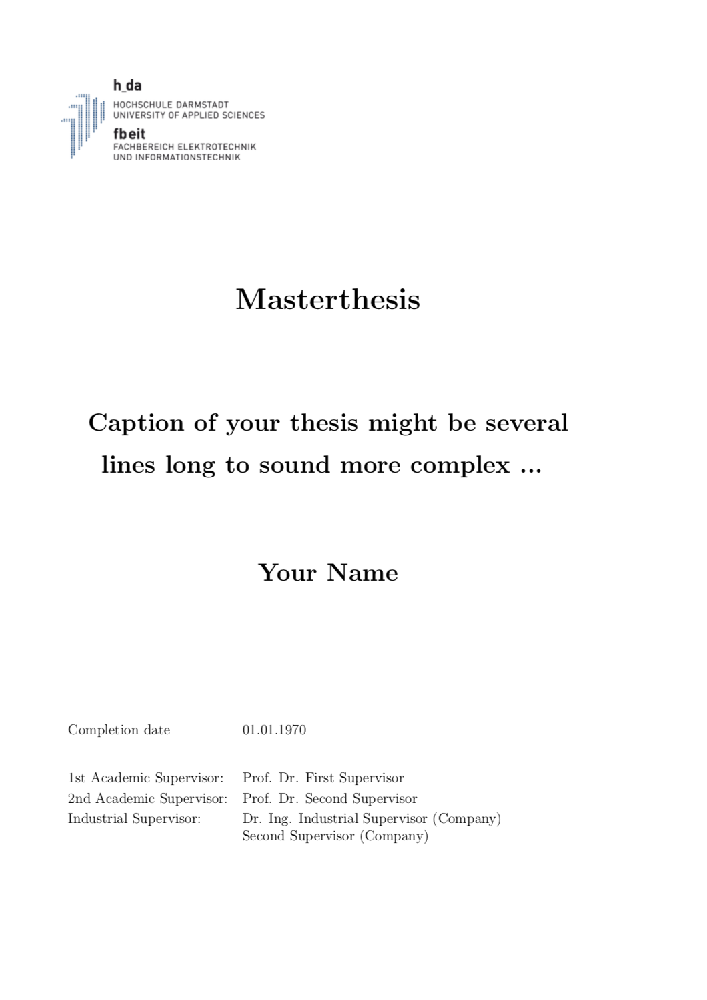
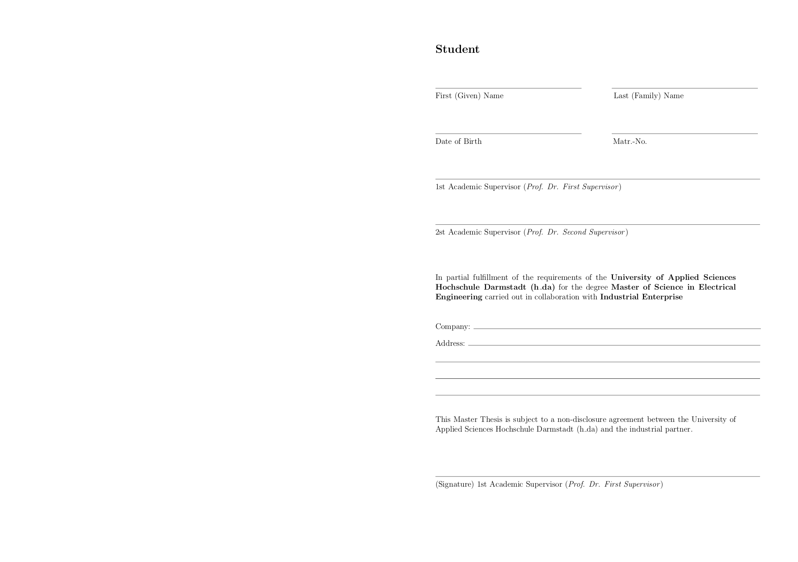
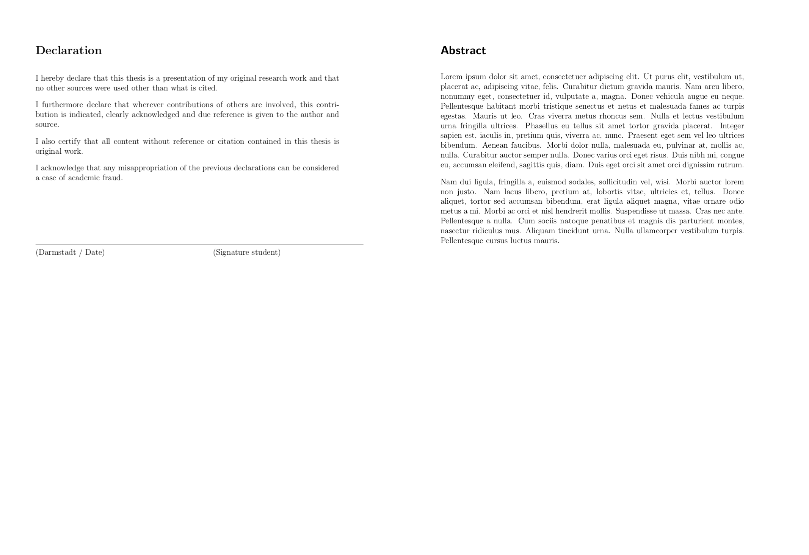

# Inofficial Latex template of a thesis flyleaf for the University of Applied Science darmstadt (hda)

This template was part of my masterthesis at hda. You can simply change it by overwriting the new command section at the beginning of the flyleaf.tex. The main.tex files serves as an example how to include the flyleaf. You could also generate a pdf and import it to your project. 

However there is no warranty or anything. It was based on a template from [Karl Heinrich Hofmann](https://www.hs-rm.de/de/hochschule/personen/hofmann-karl-heinrich/) and the HDA word template [HDA word template](https://eit.h-da.de/fileadmin/EIT/Dokumente/Elektrotechnik_MSE/Studiengangsbeschreibung/Templates/Masterarbeit/TemplateMasterThesis.doc)

 
 

Nils